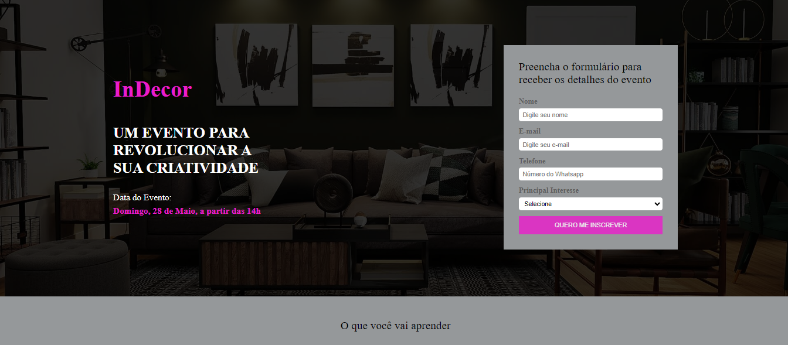
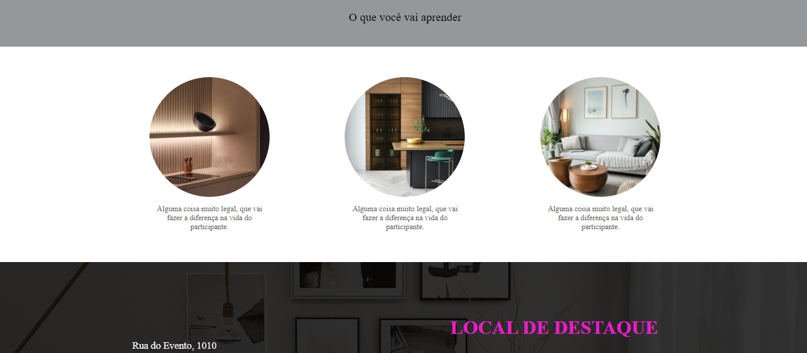
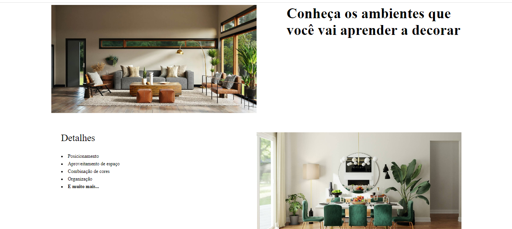
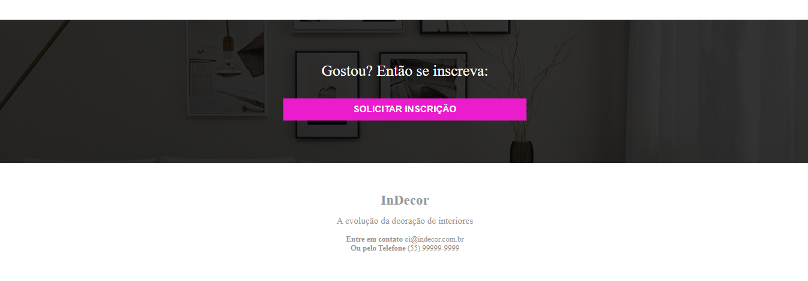

<h1> Projeto Landing Page Design de Interiores </h1>
 
 
<h2>O projeto que desenvolvi é uma landing page cativante e informativa para um evento fictício de design de interiores. Criada para atrair potenciais participantes e fornecer detalhes essenciais sobre o evento, a página destaca os aspectos mais atraentes do evento e oferece um formulário de inscrição para facilitar o registro dos interessados.     
Recursos Principais:   

Apresentação Visual Atraente: A landing page é projetada com um layout visualmente atraente que reflete o tema do design de interiores. Elementos gráficos, como imagens de ambientes bem decorados e paletas de cores harmoniosas, são utilizados para criar uma atmosfera convidativa e inspiradora.    
Informações Detalhadas sobre o Evento: A página fornece informações detalhadas sobre o evento, incluindo data, local. Essas informações ajudam os visitantes a entender melhor o que podem esperar do evento e decidir se desejam participar.   

Formulário de Inscrição Integrado: Um formulário de inscrição é incorporado à página, permitindo que os visitantes preencham facilmente suas informações pessoais e se inscrevam para participar do evento. O formulário é projetado de forma simples e intuitiva, tornando o processo de inscrição rápido e fácil.

Design Responsivo e Navegação Intuitiva: O design da landing page é responsivo, garantindo que ela seja exibida corretamente em uma variedade de dispositivos, desde desktops até smartphones. A navegação é intuitiva, com todas as informações importantes facilmente acessíveis e organizadas de forma clara e concisa.

Tecnologias Utilizadas:

HTML5: Utilizado para criar a estrutura da página web, incluindo elementos como cabeçalhos, parágrafos, listas e formulários.

CSS3: Responsável pelo estilo e layout da página, garantindo uma apresentação visualmente atraente e uma experiência de usuário agradável.

Conclusão:

A landing page que desenvolvi para o evento fictício de design de interiores é uma ferramenta eficaz para atrair participantes e fornecer informações essenciais sobre o evento. Com um design atraente, informações detalhadas e um formulário de inscrição conveniente, a página ajuda a promover o evento e facilita o processo de registro para os interessados em participar.

   
 
  <h3> Tecnologias Utilizadas </h3>
     
    
  
 

